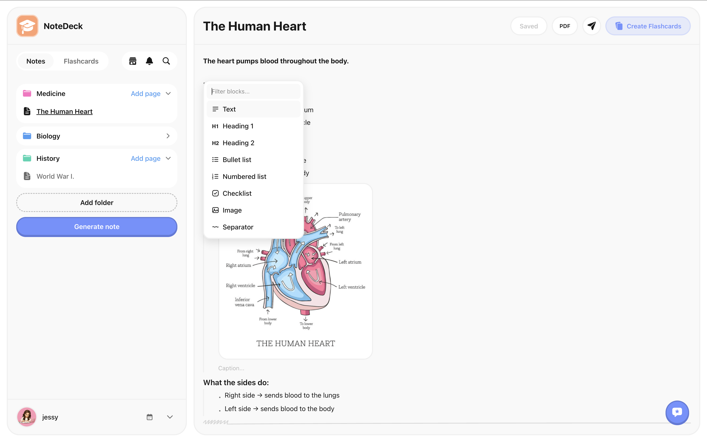
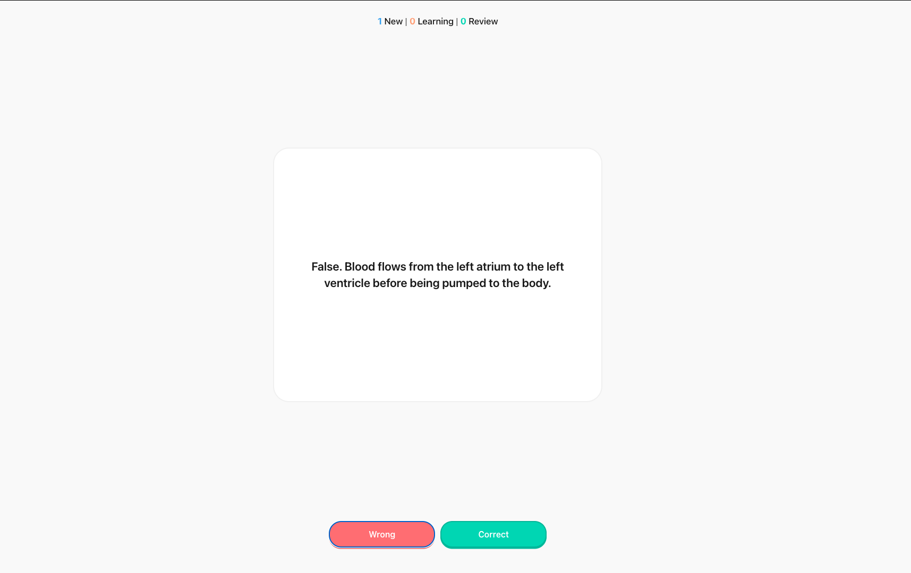
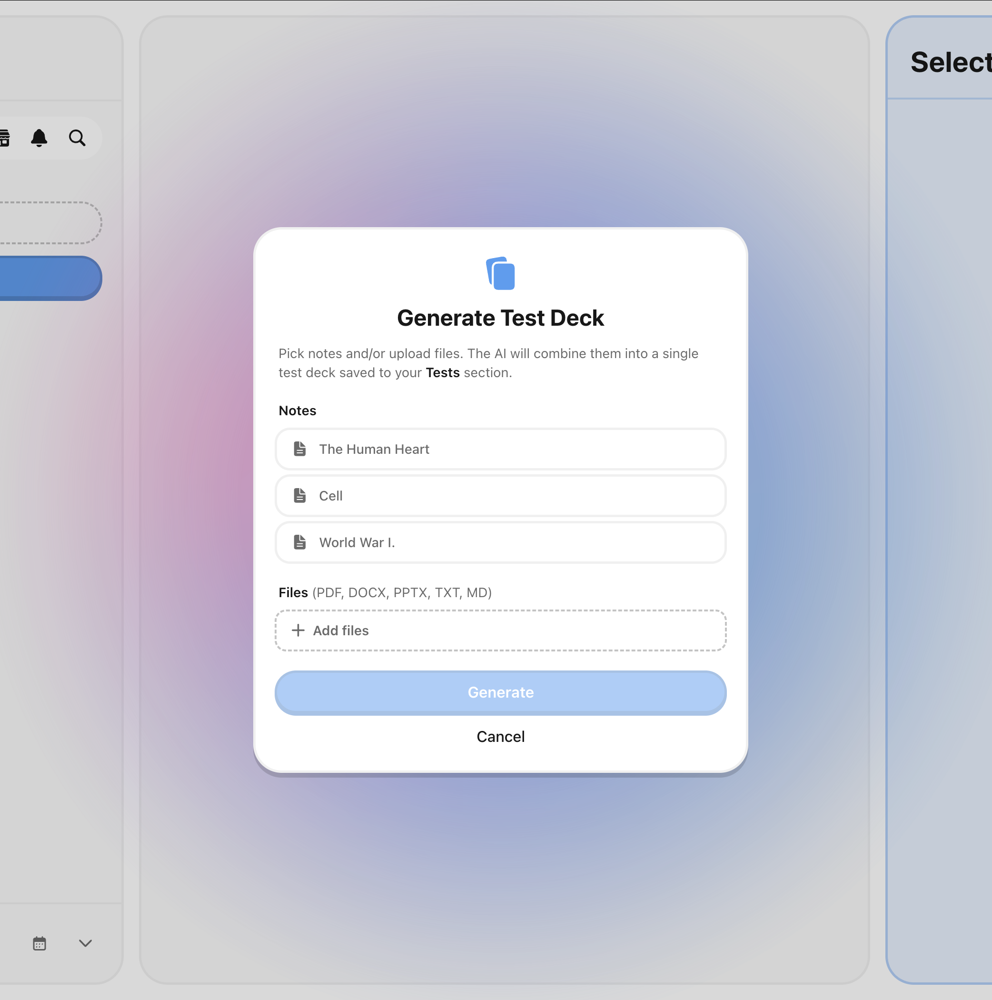
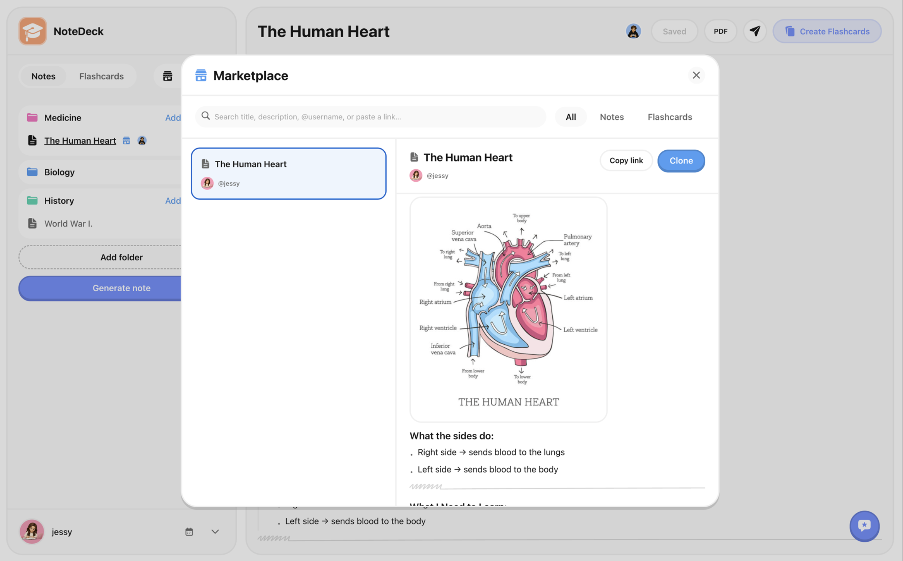
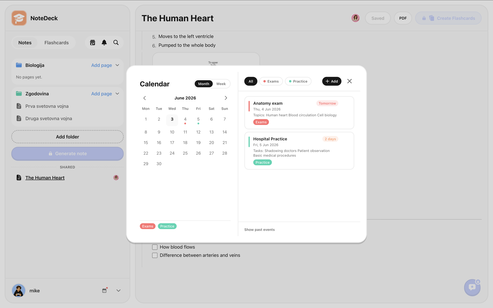
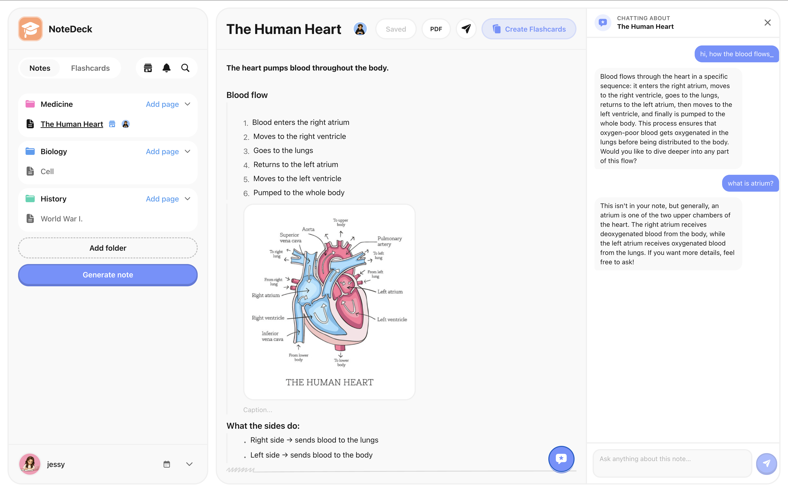

# NoteDeck

> Your all-in-one study companion — notes, flashcards, calendar, AI, and a community marketplace, in one place.

<p align="center">
  
</p>

<p align="center">
  <a href="https://notedeck.derhachov.dev"><strong>Live app → notedeck.derhachov.dev</strong></a>
</p>
<p align="center">
🎥 [Watch the NoteDeck promo](https://youtu.be/k42crs4Pl2g)
</p>

NoteDeck is a full-stack web application that brings together everything a student needs to learn,
revise and stay organised: a block-based note editor, an Anki-style flashcard system with
spaced-repetition scheduling, a built-in calendar for deadlines and exams, AI-powered content
generation (notes from files, flashcards from notes, test decks from anything), a public
marketplace for community content, and direct user-to-user sharing.

Designed as a personal knowledge tool that also recognises learning is rarely a solo activity,
NoteDeck mixes deep individual workflows (blocks, SM-2, PDF export) with collaborative ones
(shared notes, deck invites with per-deck leaderboards, marketplace clones).

---

## Table of contents

- [Who is it for](#who-is-it-for)
- [Key features](#key-features)
  - [Notes](#notes-that-build-understanding)
  - [Flashcards](#flashcards-that-make-you-remember)
  - [AI superpowers](#ai-that-does-the-heavy-lifting)
  - [Sharing and Marketplace](#sharing-built-for-students)
  - [Calendar](#calendar-to-stay-on-top-of-deadlines)
  - [Note chat assistant](#ask-anything-about-your-notes)
- [Architecture](#architecture)
- [Development workflow & quality](#development-workflow--quality)
- [Project structure](#project-structure)
- [Tech stack](#tech-stack)
- [Getting started](#getting-started)
- [Scripts](#scripts)
- [API](#api)
- [Documentation](#documentation)
- [Design](#design)

---

## Who is it for

NoteDeck is built around four user personas that recur in real study workflows:

| Persona | What they need | What NoteDeck gives them |
|---|---|---|
| **The note-taker** | A clean place to capture lectures, structure thoughts, and revisit them later. | Block-based editor with headings, lists, checklists, images, LaTeX math, color-coded folders, and one-click PDF export. |
| **The exam crammer** | A way to actually remember what they read. | Anki-style SM-2 spaced repetition, rate-1-to-4 + true/false card types, daily queues, streaks, accuracy + time-on-cards stats. |
| **The study-group student** | A way to share notes and decks with classmates and learn together. | Direct invites by `@username` (notes are co-editable, decks clone-on-accept so progress is independent), per-deck leaderboards ranked by SM-2 ease. |
| **The AI-power student** | Less time wrangling files, more time learning. | Upload a PDF / DOCX / PPTX / image → AI generates a structured note. One click turns a note into a flashcard deck. Generate test decks from a mix of notes, decks and files. Chat with an assistant grounded in any note. (Pro / Premium tier.) |

Every user persona benefits from the public **Marketplace**, where any user can opt-in publish a
note or deck for the community to preview and clone.

---

## Key features

### Notes that build understanding

Write structured, beautiful notes with a block-based editor. Each block — text, h1/h2 headings,
bullet / numbered / checklist lists, images, separators — drags, drops and transforms in place.
Slash-command `/` swaps a block type instantly. Notes live in color-coded folders, support inline
**LaTeX** rendering (`$x^2$` inline, `$$\int f(x)\,dx$$` display), and export to PDF.

<p align="center">
  
</p>

### Flashcards that make you remember

Study smarter with a proven spaced-repetition algorithm. Cards come back at exactly the right
moment — right before you forget. Two card types ("rate 1-4" for open-ended recall, "true / false"
for fact-checks), per-deck queues with daily limits, daily-streak tracking, accuracy + time
statistics, and a 30-day activity chart. When a deck is shared with at least two people, a
per-deck **leaderboard** ranks members by their average SM-2 ease — friendly competition without
revealing individual answers.

<p align="center">
  
</p>

### AI that does the heavy lifting

Let AI handle the boring parts so you can focus on actually learning. **Generate notes** from a
PDF / DOCX / PPTX / image upload (with an optional prompt to steer the result), **generate
flashcards** from any existing note (previewed and per-card editable before saving), and
**generate test decks** that combine notes, existing decks and uploaded files into one
comprehensive practice deck. Tier-gated (free / Pro / Premium).

<p align="center">
  
</p>

### Sharing built for students

Learning is better together. **Direct sharing by `@username`** sends a note or deck to a specific
classmate — notes are collaboratively editable (with live presence avatars), decks clone-on-accept
so each member's spaced-repetition progress is independent while the lineage link still drives the
shared leaderboard. The **public Marketplace** lets any user opt-in publish a note or deck for the
whole community to preview and clone; marketplace clones are fully independent, so unpublishing
the source doesn't affect them.

<p align="center">
  
</p>

### Calendar to stay on top of deadlines

A built-in calendar with **month and week views**, color-coded **tags** (Exam, Assignment,
Practice — whatever you need), and **upcoming-event warnings**: events landing in the next
24 hours are flagged urgent, in the next 3 days they are warnings. Toasts surface them right
inside the app so you never miss an exam.

<p align="center">
  
</p>

### Ask anything about your notes

A purple Duolingo-style chat button at the bottom-right of any note opens a side panel where you
can chat with an AI assistant grounded in the current note. Get explanations, summaries, "explain
like I'm five", or follow-up questions — the reply streams in token-by-token. Conversation
history persists per note in your browser's session storage.

<p align="center">
  
</p>

---

## Architecture

NoteDeck follows a classic three-tier architecture with a clear separation between the SPA frontend,
the REST API backend, and the MySQL database. Authentication is delegated to Firebase; AI features
are mediated through the OpenAI API (the key never leaves the backend).

```
┌──────────────────────────┐        ┌──────────────────────────┐        ┌───────────────────┐
│  React + Vite frontend   │  HTTPS │  Express 5 REST API      │  TCP   │  MySQL 8          │
│                          │ ─────► │  (TypeScript, tsx)       │ ─────► │  (Prisma ORM)     │
│  - block editor          │        │                          │        │                   │
│  - flashcards UI         │        │  - routers (per feature) │        │  - users          │
│  - calendar              │        │  - SM-2 scheduler        │        │  - folders/pages  │
│  - marketplace           │        │  - file extraction       │        │  - decks/cards    │
│  - chat panel            │        │  - image validation      │        │  - reviews        │
│                          │ ◄───── │                          │ ◄───── │  - invites        │
│  Firebase JS SDK         │  JSON  │  Firebase Admin SDK      │        │  - calendar       │
└────────────┬─────────────┘        └────────────┬─────────────┘        └───────────────────┘
             │                                   │
             │ ID token                          │ verify + upsert User
             ▼                                   ▼
     ┌──────────────────┐                ┌──────────────────┐
     │ Firebase Auth    │                │  OpenAI API      │
     │ (Google identity │                │  (gpt-4o-mini    │
     │  platform)       │                │   for notes,     │
     └──────────────────┘                │   flashcards,    │
                                         │   chat stream)   │
                                         └──────────────────┘
```

**How a request flows:**

1. User signs in with Firebase on the frontend → gets a JWT ID token.
2. Every API call carries `Authorization: Bearer <token>`.
3. The `requireAuth` middleware on the backend verifies the token with `firebase-admin`, then
   upserts the corresponding `User` row in MySQL (linked by Firebase UID).
4. The route handler runs scoped to `req.user.uid` and persists via Prisma.
5. AI routes additionally check the user's `tier` column (basic = 403, pro / premium = allowed)
   before calling OpenAI; the response is either returned as JSON (notes / flashcards) or streamed
   as `text/plain` chunks (note chat).

**Key design decisions:**

- **One markdown sentinel** (`<<<NoteDeckMD>>>`) wraps every note's body so the editor can detect
  its own format vs. paste from outside.
- **Spaced-repetition state** lives entirely on the backend (`src/lib/srs.ts`) — clients post an
  answer, the server returns the next interval and due-time as unix ms (`BigInt`, serialised via
  `src/lib/serialize.ts`).
- **Deck clones** (marketplace + accept-invite) duplicate the cards so a recipient's progress is
  independent; shared decks link back via `Deck.sharedFromDeckId` for the leaderboard query.
- **Uploaded images** are validated by mimetype + extension + post-write magic-byte verification,
  served with `X-Content-Type-Options: nosniff` + `Content-Disposition: inline` to defang
  polyglot payloads.
- **Public note content** has its embedded image URLs allowlisted (only `/avatars/*` or
  `/api/images/*`) so attackers can't drop tracker beacons in shared content.

A high-level ER diagram, SM-2 state diagram and use-case diagram live in
[backend/docs/SETUP.md](backend/docs/SETUP.md).

---

## Development workflow & quality

This section describes how the team works and how the codebase stays healthy.

### Work organization

- **Monorepo with Yarn 4 workspaces** — backend and frontend share a single dependency graph
  and run side-by-side from one command (`yarn dev`).
- **GitHub-flow on a single `main` branch** — short-lived feature branches, opened as pull
  requests against `main`. Each PR is reviewed by at least one teammate and must clear the
  full **Quality Gate** (see below) before it can merge.
- **Tasks and issues on GitHub** — features and bugs are captured as GitHub issues; PRs
  reference the issue(s) they close so the project history is self-documenting.
- **Component-driven UI development** — every new frontend component ships with a
  `*.stories.jsx` Storybook story (with `@storybook/test` `play` functions for interaction
  tests), so design and behaviour are reviewable in isolation. Backend route changes update
  `frontend/src/stories/Backend.mdx` so the API reference stays in sync.
- **Conventions are code** — Biome enforces formatting and import order automatically, so style
  is never a review comment.

### CI / CD pipeline

Every push to `main` triggers `.github/workflows/deploy.yml`, which runs five sequential jobs.
Any failed step aborts the pipeline before deployment.

| # | Job | What it checks / does |
|---|---|---|
| 1 | **Quality Gate** | `yarn lint` (Biome) → `yarn workspace notedeck-backend test:coverage` → `yarn workspace notedeck-frontend test:coverage` → upload lcov to **SonarCloud** and wait for the quality-gate verdict. |
| 2 | **Build & Push Backend Image** | Multi-stage Docker build of the backend → push to `ghcr.io` (GHCR). |
| 3 | **Build & Push Frontend Image** | Multi-stage Docker build of the Vite production bundle (served by Nginx) → push to `ghcr.io`. |
| 4 | **Security Scan (Docker Scout)** | Scan both freshly built images for known CVEs against the Docker Scout database. |
| 5 | **Deploy to VM** | Over SSH, upload `docker-compose.prod.yml` to the VM and `docker compose pull && up -d` the new images. |

### SonarCloud quality gate

The SonarCloud quality gate enforces, on **new code**:

- **Coverage ≥ 80 %** (lcov from Vitest)
- **Duplicated lines ≤ 3 %**
- **Zero new bugs / vulnerabilities** (reliability and security rating must stay at A)
- **Maintainability rating A** (limited technical debt)
- **All new security hotspots reviewed**

Coverage and lint configs (`sonar-project.properties`, `backend/vitest.config.ts`,
`biome.json`) are checked into the repo and reviewed alongside the code they govern.

### Quality-encoded code

A handful of design decisions move quality concerns from review checklists into the code itself:

- **TypeScript strict mode** on the backend; the frontend uses JSDoc / Prisma-generated types
  where it talks to the API.
- **Prisma as the single source of truth** for the DB schema — the `prisma:push` script means
  the running database can never silently drift from the model.
- **`requireAuth` middleware** is the only auth chokepoint — every route runs scoped to
  `req.user.uid`, so authorisation is structural, not per-handler.
- **Image upload pipeline** combines a mimetype + extension allowlist with a post-write
  magic-byte verification and a URL allowlist for embedded images in published content
  (`backend/src/lib/imageValidation.ts`) — uploads that fail any check are removed from disk.
- **Atomic deck cloning** (`backend/src/lib/cloneDeck.ts`) runs inside a single Prisma
  transaction; either the new deck + all its cards land together or neither does.

### Local quality checks

The same checks CI runs are available locally:

```bash
yarn lint                                  # Biome — checks formatting + lint rules
./node_modules/.bin/biome check --fix .    # Auto-fix safe issues
yarn test                                  # All Vitest tests
yarn test:coverage                          # Tests + lcov coverage report Sonar reads
```

---

## Project structure

```
FERINoteDeck/
├── package.json                # Yarn 4 workspaces root
├── biome.json                  # Lint / format config (whole monorepo)
├── sonar-project.properties    # SonarCloud coverage + exclusions
├── db/
│   └── docker-compose.yml      # MySQL 8 container (yarn db:up)
├── backend/                    # Express + TypeScript REST API
│   ├── prisma/
│   │   └── schema.prisma       # Single source of truth for the DB schema
│   ├── docs/
│   │   └── SETUP.md            # Local setup, ER + SM-2 + use-case diagrams
│   └── src/
│       ├── index.ts            # Express app + Swagger + route mounting
│       ├── lib/                # prisma, firebase, openai, srs (SM-2), serialize, fileExtraction, imageValidation, cloneDeck
│       ├── middleware/         # requireAuth (Firebase ID-token verify + User upsert)
│       └── routes/             # folders, pages, images, users, flashcard-folders, decks, cards,
│                               # invites, deck-invites, calendar-tags, calendar-events,
│                               # marketplace, import, search
└── frontend/                   # React 19 + Vite + Tailwind v4
    ├── ARCHITECTURE.md         # Frontend src/ layout + data flow
    ├── docs/                   # editor.md, flashcards.md, marketplace.md, search.md
    ├── public/screenshots/     # Landing-page assets (reused in this README)
    └── src/
        ├── main.jsx / routes/  # React entrypoint and react-router config
        ├── pages/              # NotesPage, LandingPage, Login, Register, VerifyEmail, ChooseUsername
        ├── features/notes/     # sidebar, folder list, block editor, invites, chat panel, AccountModal
        ├── features/flashcards/    # decks, cards, study session (SM-2), invites, leaderboard
        ├── features/marketplace/   # browse, preview, clone public notes / decks
        ├── features/calendar/      # month / week views, events with tags, upcoming-event toasts
        ├── features/search/        # Spotlight-style cross-feature search
        ├── components/         # DuoButton, Modal, Icon, ShareModal, ConfirmDialog…
        ├── hooks/              # useMediaQuery, useResizableWidth, useContextMenu
        └── services/           # notesService, flashcardsService, marketplaceService,
                                # calendarService, searchService — all fetch() with Firebase Bearer
```

---

## Tech stack

| Layer | Technology |
|---|---|
| Backend | Node.js, Express 5, TypeScript, tsx |
| Database | MySQL 8 via Prisma (Docker Compose in `db/`) |
| Auth | Firebase Authentication (`firebase-admin` verifies ID tokens server-side) |
| AI | OpenAI `gpt-4o-mini` (structured JSON for notes / cards, streaming for chat) |
| Frontend | React 19, Vite, Tailwind CSS v4, react-router 7, KaTeX (math), `@dnd-kit` (drag) |
| Component docs | Storybook 10 (React + Vite) |
| API docs | Swagger UI (`swagger-jsdoc` + `swagger-ui-express`) |
| Testing | Vitest (BE unit + FE unit, jsdom) |
| Linting | Biome (lint + format, whole monorepo) |
| CI / quality | GitHub Actions → SonarCloud quality gate (lint, tests, coverage, duplications, hotspots) |
| Deployment | Docker images → GHCR → Nginx ([docs/deployment.md](docs/deployment.md)) |
| Monorepo | Yarn 4 workspaces (via Corepack) + concurrently |

---

## Getting started

**Prerequisites**: Node.js ≥ 18, Docker (for the MySQL container), a Firebase project, and
optionally an `OPENAI_API_KEY` to enable the AI features. The full setup walk-through
(MySQL user / DB, Prisma migrations, Firebase service account + web config) lives in
**[backend/docs/SETUP.md](backend/docs/SETUP.md)** — start there.

```bash
yarn                                            # install all workspace deps
cp backend/.env.example backend/.env            # then fill in DB + Firebase + OpenAI
cp frontend/.env.example frontend/.env          # Firebase web config
yarn workspace notedeck-backend prisma:push     # create the MySQL tables
yarn dev                                         # backend + frontend + Storybook (concurrently)
```

`yarn dev` automatically starts the MySQL container via the `predev` hook, so a separate
`docker compose up` is not needed.

| Service | URL |
|---|---|
| Backend API | http://localhost:3001 |
| Swagger UI | http://localhost:3001/api-docs |
| Frontend | http://localhost:5173 |
| Storybook | http://localhost:6006 |

---

## Scripts

From the **repo root**:

```bash
yarn dev              # backend (tsx watch), frontend (Vite), Storybook — concurrently
yarn build            # compile backend TS (prisma generate + tsc) + Vite production build
yarn lint             # Biome checks across the whole monorepo
yarn test             # run all Vitest tests (backend + frontend)
yarn test:coverage    # tests + v8 coverage report (used by CI / SonarCloud)
yarn db:up            # start the MySQL container
yarn db:down          # stop the MySQL container (data preserved in db/data/)
```

Per workspace:

```bash
yarn workspace notedeck-backend dev          # backend only (tsx watch)
yarn workspace notedeck-backend prisma:push  # sync schema.prisma into MySQL
yarn workspace notedeck-frontend dev         # frontend only (Vite)
yarn workspace notedeck-frontend storybook   # Storybook dev server
```

Auto-fix lint / format: `./node_modules/.bin/biome check --fix .`

---

## API

Base URL `http://localhost:3001/api`. Every route requires an
`Authorization: Bearer <Firebase ID token>` header and is scoped to the authenticated user.
Browse the full, live spec at **`/api-docs`** (Swagger). Route groups:

- **Notes**: `/folders`, `/pages` (incl. `/pages/shared`, `/pages/:id/presence`,
  `/pages/:id/generate-deck`, `/pages/:id/chat` — streaming), `/images` (helmet-secured, magic-byte verified)
- **Flashcards**: `/flashcard-folders`, `/decks` (incl. `/decks/:id/queue`,
  `/decks/:id/leaderboard`, `/decks/:id/generate-test`), `/cards` (incl. `/cards/:id/answer`,
  `/cards/:id/reset`)
- **Direct sharing**:
  - `/invites` — note-share invites (POST / GET pending, `/sent`, PATCH accept / decline, DELETE revoke)
  - `/deck-invites` — deck-share invites (accept clones the deck and links via `Deck.sharedFromDeckId`)
- **Marketplace**: `/marketplace` (search public notes + decks), `/marketplace/notes/:id`,
  `/marketplace/decks/:id`, `/marketplace/*/clone`
- **Calendar**: `/calendar-tags`, `/calendar-events` (incl. `/calendar-events/upcoming` for the
  3-day warning / urgent buckets)
- **Import (AI)**: `/import` — multipart file upload + prompt → structured note (tier-gated)
- **Search**: `/search?q=` (cross-feature, relevance-sorted, scoped to the caller)
- **Account**: `/users/me`, `/users/me/avatar`, `/users/me/study-settings`

Data is persisted in MySQL (see the ER diagram in [backend/docs/SETUP.md](backend/docs/SETUP.md)).

---

## Documentation

- [backend/docs/SETUP.md](backend/docs/SETUP.md) — local setup, ER diagram, SM-2 state diagram, use-case diagram, API overview
- [frontend/ARCHITECTURE.md](frontend/ARCHITECTURE.md) — frontend structure & data flow
- [frontend/docs/editor.md](frontend/docs/editor.md) — the block-based note editor
- [frontend/docs/flashcards.md](frontend/docs/flashcards.md) — flashcards, SM-2 spaced repetition, deck invites + leaderboard
- [frontend/docs/marketplace.md](frontend/docs/marketplace.md) — sharing + marketplace + clone flow
- [frontend/docs/search.md](frontend/docs/search.md) — cross-feature search + relevance scoring
- [docs/deployment.md](docs/deployment.md) — Docker / GHCR / Nginx CI-CD pipeline

A live component catalogue is also available via **Storybook** (`yarn workspace notedeck-frontend storybook`)
at http://localhost:6006 — every UI component has interaction tests (`play` functions) and the
backend API reference lives there as well (`Backend.mdx`).

---

## Design

Original UI design and prototypes:
**[Figma — NoteDeck](https://www.figma.com/design/6tgxbVBCI2aQEKWJ6ljoyo/NoteDeck?node-id=2028-172&t=TxnQ93y2De1SI7VC-1)**

Visual style is loosely "Duolingo-meets-Notion": offset shadows on every primary button, generous
border radii (22.5 px / 30 px), folder colour as a primary navigation cue, and a single rounded
sans-serif (`ui-rounded` / SF Pro Rounded) throughout. Light theme only.
